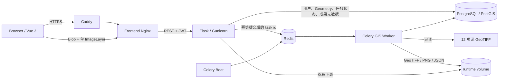

# 系统架构概览

## 关键边界

- PostgreSQL/PostGIS 是用户、任务归属、Geometry、状态、时间戳、幂等关系和成果元数据的
  事实源；Redis 不保存长期任务事实。
- Redis 同时承担 Celery broker、每用户固定窗口限流和 refresh JTI 撤销；大型 GeoJSON、
  GeoTIFF 与 PNG 不进入 Redis。
- Celery Worker 使用条件状态迁移、延迟确认、丢失重投和有限 I/O 重试；Beat 只发布待分发
  reconciliation 与 TTL 清理任务。
- 源栅格只读挂载；生成的 GeoTIFF、透明 PNG 和 manifest 放在 runtime volume，通过 owner
  鉴权 API 返回。
- Backend Contract 统一 WGS84 / EPSG:4326；WGS84↔GCJ-02 只发生在前端高德适配边界。
- 生产环境由 Caddy 负责域名/HTTPS，Compose Frontend 只绑定宿主机 loopback。

项目继续采用分层单体和独立 Worker，不为简历展示引入微服务、Kafka、Kubernetes 或 GeoServer。
